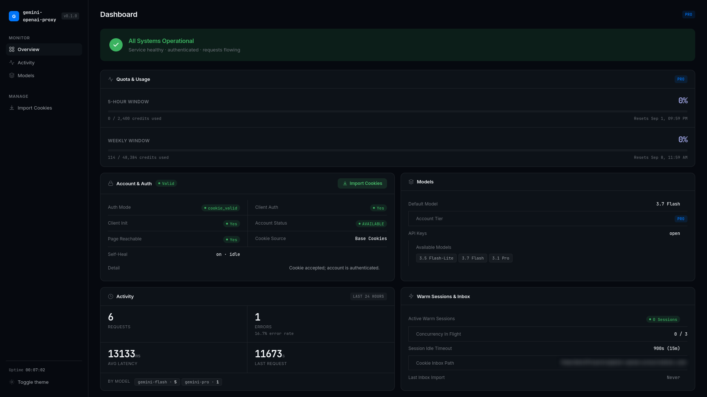
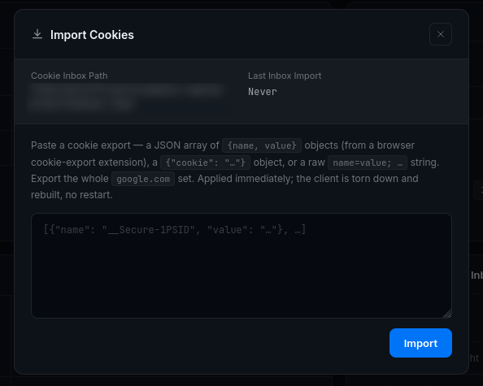
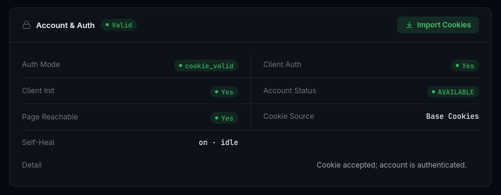
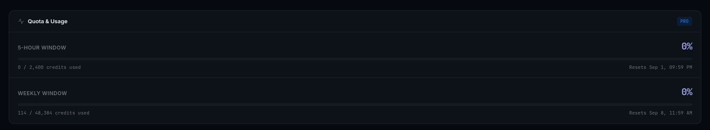
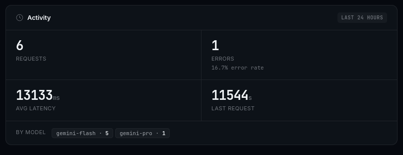

# Gemini Web → OpenAI-compatible API gateway

An HTTP service that authenticates to `gemini.google.com` (the consumer Gemini web
app) with browser session cookies and exposes it as a programmable API in two wire
formats:

- **OpenAI-compatible**: `/v1/chat/completions`, `/v1/responses`, `/v1/models`
- **Google-native**: `/v1beta/models/{model}:generateContent` etc.

No Google Cloud project, no API key, no billing. It reuses one personal Google
account's existing Gemini access, via [`gemini_webapi`](https://github.com/HanaokaYuzu/Gemini-API)
for session/protocol handling.

**API reference:** [`docs/API.md`](docs/API.md)

---

## Features

| Area | |
|---|---|
| **Authenticated account** | runs as your own Google account's Gemini session, using your browser's session cookies, no Google API key, no billing account. Sign in by adding your cookies; see [Cookie file](#cookie-file) for how. Without cookies configured, it still runs, just on Gemini's free anonymous tier. |
| **API access control** | optionally lock down `/v1/*` and `/v1beta/*` behind your own API key(s); open by default (with a startup warning) if you don't set any. Separate entirely from the admin credential. See [Authentication](#authentication) below. |
| **Models** | live per-account list, fetched from `GET /v1/models` (or `GET /v1beta/models` on the Google-native side); `-high` suffix → extended thinking; unknown model → 4xx with the real list, never a silent swap |
| **OpenAI** | `/v1/chat/completions` + `/v1/responses` (independent surfaces), streaming, multimodal in/out, prompt-engineered tool calling |
| **Google-native** | `/v1beta` model list + `generateContent` + `streamGenerateContent` (`?alt=sse` or JSON array) |
| **Images** | both directions: send an image with your prompt (by URL or inline base64), and get one back if Gemini's reply includes one (returned inline, base64-encoded, not just a link). MIME is sniffed from the file's actual bytes, not trusted from what you label it. See the image fields under [`POST /v1/chat/completions`](docs/API.md#post-v1chatcompletions) (OpenAI) or [`POST .../generateContent`](docs/API.md#post-v1betamodelsmodelgeneratecontent) (Google) in `docs/API.md` for the exact request/response shape. |
| **Metadata** | every response carries `x_gemini_proxy`: the *validated* served model (not the model's self-claim) plus other request-level detail |
| **Credit / quota tracking** | when the account exposes it, live usage (`usage_info`/`quotas`) shows up in `x_gemini_proxy` on every response and as its own panel on the admin dashboard, no separate call needed. This comes straight from what `gemini_webapi` reads off the account; it's confirmed working on a Google AI Pro account, unconfirmed whether Google surfaces the same usage/credit data for free-tier accounts, if it doesn't, this field will simply be empty for you rather than erroring. |
| **Reliability** | one shared connection, capped at `max_concurrent_generations`; over the cap gets a `503` and should be retried |
| **Observability** | `/status`: three independent health signals plus a 24h request-history summary |
| **Admin** | dashboard at `/` (or `/admin`) with hot cookie reload, own credential, separate from `api_keys`; see [Admin dashboard: username and password](#admin-dashboard-username-and-password) |
| **Temporary chat** | per-request / config default; keeps the chat out of Google's account history |
| **Warm sessions** | opt-in `/v1/sessions`, reuse an established conversation instead of paying per-request setup cost (experimental, not yet benchmarked in this deployment) |

The admin dashboard, at a glance:



---

## Quick start

**Using `pip`** (standard, no extra tools):

```bash
python3 -m venv .venv
source .venv/bin/activate
pip install -r requirements.txt
cp config.example.json config.json
```

**Using [`uv`](https://github.com/astral-sh/uv)** (faster installer, same result):

```bash
uv venv --python 3.13
source .venv/bin/activate
uv pip install -e ".[dev]"
cp config.example.json config.json
```

Then start it:

```bash
python -m app                          # reads host/port from config.json
# or, without the CLI wrapper:
uvicorn app.main:app --port 8000       # port here overrides config.json's "port"
```

```bash
curl -s localhost:8000/status | python -m json.tool
```

You don't need cookies to start it. With none configured, the service runs on
Gemini's free anonymous tier automatically. See [Cookie file](#cookie-file)
below when you're ready to sign in with your own account.

## Usage examples

Point any OpenAI-compatible client at `http://localhost:8000/v1`. `api_key` can be
anything unless you've set `api_keys` in the config.

**Python** (`openai` SDK):

```python
from openai import OpenAI

client = OpenAI(base_url="http://localhost:8000/v1", api_key="unused")

response = client.chat.completions.create(
    model="gemini-flash",
    messages=[{"role": "user", "content": "hi"}],
)
print(response.choices[0].message.content)
```

Streaming:

```python
stream = client.chat.completions.create(
    model="gemini-flash",
    messages=[{"role": "user", "content": "write a haiku about rivers"}],
    stream=True,
)
for chunk in stream:
    delta = chunk.choices[0].delta.content
    if delta:
        print(delta, end="", flush=True)
```

**Node.js** (`openai` SDK):

```js
import OpenAI from "openai";

const client = new OpenAI({
  baseURL: "http://localhost:8000/v1",
  apiKey: "unused",
});

const response = await client.chat.completions.create({
  model: "gemini-flash",
  messages: [{ role: "user", content: "hi" }],
});
console.log(response.choices[0].message.content);
```

**curl** (raw HTTP, no SDK):

```bash
curl -s http://localhost:8000/v1/chat/completions \
  -H "Content-Type: application/json" \
  -d '{"model": "gemini-flash", "messages": [{"role": "user", "content": "hi"}]}' \
  | python -m json.tool
```

See [`docs/API.md`](docs/API.md) for image attachments, tool calling, the
Google-native surface, and full request/response shapes.

## API endpoints

Full detail (request/response bodies, headers, error shapes) for every row
lives in `docs/API.md`, linked below.

**OpenAI-compatible**

| Endpoint | Docs |
|---|---|
| `GET /v1/models` | [`docs/API.md`](docs/API.md#get-v1models) |
| `POST /v1/chat/completions` | [`docs/API.md`](docs/API.md#post-v1chatcompletions) |
| `POST /v1/responses` | [`docs/API.md`](docs/API.md#post-v1responses) |

**Google-native**

| Endpoint | Docs |
|---|---|
| `GET /v1beta/models` | [`docs/API.md`](docs/API.md#get-v1betamodels) |
| `GET /v1beta/models/{model}` | [`docs/API.md`](docs/API.md#get-v1betamodelsmodel) |
| `POST /v1beta/models/{model}:generateContent` | [`docs/API.md`](docs/API.md#post-v1betamodelsmodelgeneratecontent) |
| `POST /v1beta/models/{model}:streamGenerateContent` | [`docs/API.md`](docs/API.md#post-v1betamodelsmodelstreamgeneratecontent) |

**Warm sessions** (opt-in, see [Features](#features))

| Endpoint | Docs |
|---|---|
| `POST /v1/sessions` | [`docs/API.md`](docs/API.md#warm-sessions-reusing-a-conversation) |
| `GET /v1/sessions` | [`docs/API.md`](docs/API.md#warm-sessions-reusing-a-conversation) |
| `GET /v1/sessions/{id}` | [`docs/API.md`](docs/API.md#warm-sessions-reusing-a-conversation) |
| `DELETE /v1/sessions/{id}` | [`docs/API.md`](docs/API.md#warm-sessions-reusing-a-conversation) |

**Admin** (own credential, see [Admin dashboard: username and password](#admin-dashboard-username-and-password))

| Endpoint | Docs |
|---|---|
| `GET /admin` | [`docs/API.md`](docs/API.md#admin-dashboard) |
| `GET /admin/status.json` | [`docs/API.md`](docs/API.md#admin-dashboard) |
| `POST /admin/cookies` | [`docs/API.md`](docs/API.md#admin-dashboard) |

**Operational** (no auth required)

| Endpoint | Docs |
|---|---|
| `GET /healthz` | [`docs/API.md`](docs/API.md#get-healthz) |
| `GET /status` | [`docs/API.md`](docs/API.md#get-status) |

**Interactive docs (no separate table row, always available)**

Once the service is running, FastAPI generates live, always-current API docs
for every endpoint automatically, no setup needed:

- **Swagger UI**: `http://localhost:8000/docs`
- **ReDoc**: `http://localhost:8000/redoc`
- raw OpenAPI schema: `http://localhost:8000/openapi.json`

**Both these and `GET /status` are gated behind the admin credential by
default.** `/status` only ever exposes health counters, but `/docs` and
`/openapi.json` expose your entire API surface (every route, every
request/response schema, including the admin endpoints' shapes), and
Swagger UI's "Try it out" button lets a visitor send real requests straight
from the browser, so both default to requiring the same admin
username/password as `/admin` (see
[Admin dashboard: username and password](#admin-dashboard-username-and-password)).

This is controlled by two config keys, each accepting `"admin"` (the
default: gated behind the admin credential), `"open"` (no auth at all,
matches this service's behavior before this was added), or `"disabled"`
(the routes don't exist, `404` for anyone):

```json
{ "docs_access": "admin", "status_access": "admin" }
```

Set either to `"open"` if you want the old no-auth behavior back (e.g. for
local development, or a monitoring tool that can't send credentials), or to
`"disabled"` to remove the routes entirely in a locked-down deployment.

You don't have to edit `config.json` for this, both keys also work as
environment variables (see [Environment variables](#environment-variables)),
which is often more convenient for a one-off local run or a Docker
deployment:

```bash
GEMINI_PROXY_DOCS_ACCESS=open GEMINI_PROXY_STATUS_ACCESS=open python -m app
```

---

## Configuration

### Authentication

By default, anyone who can reach this service can use it, no key required.
That's fine for local/personal use on a machine only you can reach, but if
you're exposing this beyond localhost, you'll want to lock it down.

Set `api_keys` in `config.json` to a list of one or more strings:

```json
{ "api_keys": ["sk-local-abc123"] }
```

Once set, every `/v1/*` and `/v1beta/*` request must include one of those
keys, checked in this order (first one present wins):

| Form | Example |
|---|---|
| Bearer token | `Authorization: Bearer sk-local-abc123` |
| `x-api-key` header | `x-api-key: sk-local-abc123` |
| `x-goog-api-key` header | `x-goog-api-key: sk-local-abc123` |
| query parameter | `?key=sk-local-abc123` |

A missing or wrong key gets a `401`. `GET /healthz` and `GET /status` never
need a key, they only expose health signals, not generation access.

**This is a separate system from the admin dashboard's credential.** A
generation API key grants no admin access, and the admin password grants no
generation access, see [Admin dashboard: username and password](#admin-dashboard-username-and-password).
Full detail, including error response shapes, lives in
[`docs/API.md`](docs/API.md#authentication).

### Config file discovery

On startup the first file found in this order is loaded (the rest are ignored):

1. path passed with `-c` / `--config`
2. path named by the `GEMINI_PROXY_CONFIG` environment variable
3. `./config.json` (current working directory)
4. `$XDG_CONFIG_HOME/gemini-web-to-openai-proxy/config.json`
   (falls back to `~/.config/gemini-web-to-openai-proxy/config.json`)

If none exist, **built-in defaults are used**: the service runs with zero
configuration (anonymous/guest tier, open endpoints).

The file must be a single JSON object; unknown keys are ignored, omitted keys
fall back to their default. Copy [`config.example.json`](config.example.json) to
start.

Relative paths in the config (`cookie_file`, `data_dir`) resolve against the
**config file's own directory**; if there is no config file they resolve against
the current working directory.

> For most local setups, only step 3 (`./config.json`) ever matters. Steps 2 and
> 4 exist for running this as an installed package outside its own project
> folder (see [Environment variables](#environment-variables) if that applies
> to you); you can otherwise ignore them.

### Config keys

| Key | Type | Default | Meaning |
|---|---|---|---|
| `host` | string | `"127.0.0.1"` | listen address (overridden by `--host`) |
| `port` | integer | `8000` | listen port (overridden by `--port`) |
| `request_timeout` | number (s) | `180.0` | hard ceiling on a single non-streaming generation, then `504` |
| `default_model` | string | `"gemini-flash"` | model used when a request omits `model` |
| `api_keys` | string[] | `[]` | generation-endpoint keys; empty means endpoints are open (startup warning) |
| `cookie_file` | string (path) | `"cookies.json"` | Gemini Web session cookie export (see below) |
| `temporary_chat_default` | boolean | `false` | default for "don't save to Gemini account history"; per-request override exists |
| `force_anonymous` | boolean | `false` | ignore the cookie file and the library's rotated-cookie cache, disable auto-refresh, forces guest tier |
| `connection_timeout` | number (s) | `60.0` | passed to `gemini_webapi` as its request timeout |
| `zombie_stream_timeout` | number (s) | `90.0` | passed as the library's stream watchdog timeout |
| `cookie_refresh_interval` | number (s) | `600.0` | how often the library refreshes cookies/token in the background |
| `cookie_cache_dir` | string (path) or null | `null` | where `gemini_webapi` keeps its rotated-cookie cache; defaults to `{data_dir}/gemini_webapi` |
| `auto_refresh` | boolean | `true` | let the library keep the session token fresh in the background; turn off only when another process already owns refresh for the same account |
| `self_heal_interval` | number (s) | `600.0` | if the client sits in a degraded (not-`AVAILABLE`) state, re-init it on this interval until it recovers; each consecutive failure doubles the wait (cap 1h); `0` disables |
| `max_concurrent_generations` | integer | `3` | how many generations may run against the one shared upstream connection at once; `2`-`4` recommended, `1` serializes all callers (a warning is logged) |
| `slot_wait_timeout` | number (s) | `60.0` | how long a request waits for a generation slot before a `503` (`code: "capacity"`) |
| `activity_log_retention_days` | integer | `7` | how long request-history rows are kept in `{data_dir}/activity.db` |
| `warm_session_idle_timeout` | number (s) | `900.0` | a warm session is dropped after this long without use |
| `max_warm_sessions` | integer | `20` | cap on live warm sessions; least-recently-used is evicted past this |
| `admin_username` | string | `"admin"` | username for the admin dashboard's HTTP Basic auth |
| `docs_access` | string | `"admin"` | who can reach `/docs`, `/redoc`, `/openapi.json`: `"admin"` (gated behind the admin credential), `"open"` (no auth), or `"disabled"` (routes don't exist) |
| `status_access` | string | `"admin"` | same three options, for `GET /status` |
| `cookie_watch_interval` | number (s) | `15.0` | how often to check the cookie file for a new session; `0` disables the watcher |
| `cookie_watch_file` | string (path) or null | `null` | an extra file mirrored into `cookie_file` when it changes (drop-a-file recovery) |
| `image_fetch_timeout` | number (s) | `20.0` | per-image timeout when fetching a remote image URL for input |
| `max_image_bytes` | integer | `20971520` (20 MiB) | max decoded size of a single input image; larger is rejected (that image only) |
| `data_dir` | string (path) | `"data"` | directory for local state: cookie cache, `activity.db`, `admin_credential`. See [`data_dir` contents](#data_dir-contents). |

### Cookie file

A missing or empty cookie file is not an error: the service falls back to
Gemini's anonymous/guest tier (only the default model is usable there). Adding
your own cookies unlocks your account's actual models and quota.

**Easiest: the admin web UI.** Start the service, open `http://localhost:8000/admin`
in a browser, log in with the admin credential printed in the startup logs
(see [Admin dashboard](docs/API.md#admin-dashboard) for details), and paste
your cookie export into the import form there. This writes the cookies
straight into `cookie_file` (`cookies.json` by default) for you and reloads
the session immediately, no restart needed.



**If the web UI isn't reachable** (headless server, internal-only deployment,
no browser access to the machine), write the file yourself: put your export
directly at the path named by `cookie_file` in `config.json` (`./cookies.json`
by default). Same result, just done by hand instead of through the form.

Either way, the two cookies that actually carry a session are `__Secure-1PSID`
(long-lived) and `__Secure-1PSIDTS` (short-lived, auto-rotated). Export the
**whole `google.com` cookie set** if you can; the refresh path touches
`accounts.google.com`. Recommended: export from **Firefox**. Chromium-based
browsers (Chrome, Edge, Brave) can bind an exported session to the device so
it dies within hours.

#### How to actually export your cookies

This trips people up, so it's worth spelling out: **you need to export
cookies from `google.com`, not from `gemini.google.com`.** Most browser
cookie-export extensions only grab cookies for whatever site is open in the
current tab. If you export while sitting on `gemini.google.com`, you'll
often miss cookies that only ever get set on the wider `google.com` domain
(and the session-refresh path specifically needs those, since it talks to
`accounts.google.com`, not `gemini.google.com`).

1. Sign in to your Google account in the browser, if you aren't already.
2. Open a new tab and go to **`https://google.com`** (the plain domain,
   not Gemini) and let it fully load.
3. With that tab active, run your cookie-export extension and export
   cookies **for that tab/domain**, not for a `gemini.google.com` tab.
4. Paste the result into the admin dashboard's import form, or save it to
   your `cookie_file` as described above.

Two extensions that do this well (mentioned for convenience only, **not an
endorsement or affiliation, use at your own judgment**):

- Firefox: [Instant Cookie Exporter](https://addons.mozilla.org/en-US/firefox/addon/instant-cookie-exporter/)
- Chrome/Chromium: [Cookie-Editor](https://chromewebstore.google.com/detail/cookie-editor/ookdjilphngeeeghgngjabigmpepanpl)

Either one will export in the JSON array format shown above, which this
service reads directly.

Accepted formats when writing the file yourself (auto-detected, you don't
declare which):

**Browser-extension JSON array** (e.g. "Cookie-Editor" export):

```json
[
  { "name": "__Secure-1PSID",   "value": "g.a000…", "domain": ".google.com" },
  { "name": "__Secure-1PSIDTS", "value": "sidts-…", "domain": ".google.com" }
]
```

**Wrapped raw string:** `{ "cookie": "__Secure-1PSID=g.a000…; __Secure-1PSIDTS=sidts-…; NID=…" }`

**Raw cookie-header string** (file contents, no JSON): `__Secure-1PSID=g.a000…; __Secure-1PSIDTS=sidts-…; NID=…`

**Flat JSON object:** `{ "__Secure-1PSID": "…", "__Secure-1PSIDTS": "…" }`

Verify an export before trusting it:

```bash
python scripts/check_cookies.py path/to/cookies.json
```

It prints the `__Secure-1PSID` fingerprint (so two exports can be told apart),
the resolved account status, and per-model availability. A **GUEST /
UNAUTHENTICATED** verdict means the export is the wrong account, an
unprovisioned account (open Gemini in that browser and send one message
first), or a device-bound Chromium export.

You can confirm the same thing visually on the admin dashboard, `Valid`
next to "Account & Auth" means the cookies were accepted:



> `__Secure-1PSID` belongs to the browser's **primary** Google account;
> switching accounts inside the Gemini web UI does not change it. Export from a
> browser/profile signed into **only** the account you want.

The file is re-read automatically when its modification time or size changes.
A file that can't be parsed is logged and treated as "no cookies" rather than
crashing. `gemini_webapi` also keeps its own rotated-cookie cache under
`{data_dir}/gemini_webapi/`; deleting `cookie_file` alone does **not** end the
session, clear that directory too, or set `force_anonymous: true`.

#### The `__Secure-1PSIDTS` freshness trap

`__Secure-1PSIDTS` rotates every ~10-30 minutes and Google tracks the current
value server-side. A **stale** one still gets a token back, but the session is
marked `UNAUTHENTICATED` (`/status` shows `authenticated` from the cookie file,
but non-default models and image upload are refused). An export captured
minutes ago is fine, background refresh keeps it current from there. If
you see this with cookies you know are for the right, provisioned account,
re-export right after loading `gemini.google.com` and start the service
promptly.

### Temporary (unlogged) chat

`temporary_chat_default` (and the per-request override: `temporary_chat` on
the OpenAI/Responses bodies, `temporaryChat` on Google) sets Gemini's own
"temporary chat" flag, keeping the conversation **out of the Google account's
saved chat history**. It has **no effect** on this service's own request
history (`activity.db`): that always records that a request happened (model,
latency, ok/fail; never the prompt text). For true end-to-end non-logging, use
temporary chat *and* keep `activity_log_retention_days` low.

### CLI flags

```
python -m app [options]
```

| Flag | Meaning |
|---|---|
| `-c PATH`, `--config PATH` | explicit config file path |
| `--host HOST` | override `host` |
| `--port PORT` | override `port` |
| `--reload` | uvicorn dev auto-reload |

Or run as a plain ASGI app, bypassing the CLI wrapper:

```bash
uvicorn app.main:app --port 8000
```

### Environment variables

**Short answer: you don't need to set any of these.** If you just edit
`config.json` and run `python -m app`, every one of these is optional and the
built-in defaults are fine. They exist for edge cases (installed-package
setups, Docker) that most local runs never hit.

| Variable | Required? | Effect |
|---|---|---|
| `GEMINI_PROXY_LOG_LEVEL` | No | Log verbosity (default `INFO`). Set to `DEBUG` when troubleshooting. |
| `ADMIN_PASSWORD` | No | Pins the admin dashboard password. If you don't set this, one is generated randomly on first boot and printed in the startup logs, which is fine for local use, but set this yourself if you want a password you can remember. |
| `GEMINI_PROXY_CONFIG` | No | Path to `config.json`, as an alternative to running `python -m app --config <path>`. Only matters if you run the app from a different folder than where `config.json` lives. |
| `XDG_CONFIG_HOME` | No | Only used if you installed this as a system package (not this repo layout) and never point it at a config file directly. You can ignore this entirely. |
| `GEMINI_COOKIE_PATH` | No | Where `gemini_webapi`'s internal cache lives. `cookie_cache_dir` in `config.json` does the same job and takes priority, so you'd only set this if you're not using a config file at all. |
| `GEMINI_PROXY_<KEY>` | No | Lets you override any `config.json` key via an env var instead, e.g. `GEMINI_PROXY_PORT=9000`. Only useful for Docker, where setting an env var on the container is easier than editing a file inside it. |

If you do want to set any of these, the easiest way is a `.env` file in the
project root (loaded automatically at startup; a real environment variable
always takes priority over it):

```bash
# .env
GEMINI_PROXY_LOG_LEVEL=DEBUG
ADMIN_PASSWORD=change-me-please
```

### `data_dir`: what it is and why it exists

`data_dir` (default: a `./data` folder created next to the app) is just local
storage the service keeps for itself between restarts, the same idea as a
browser's cache folder. **You never create or edit anything in it by hand**,
it's created automatically the first time you run the app. It holds three
things:

1. **Your login session, cached.** Google rotates part of your cookie
   (`__Secure-1PSIDTS`) automatically every 10-30 minutes. The service tracks
   the current rotated value here so that restarting the app doesn't force
   you to re-export cookies from your browser every time.
2. **A small local log of past requests** (`activity.db`), just enough to
   power the "how many requests in the last 24h, how many failed" summary on
   `/status` and the admin dashboard. Not your prompts or replies, just
   counts and timing.
3. **The admin dashboard's auto-generated password** (only if you haven't set
   `ADMIN_PASSWORD` yourself).

If you're running this with Docker, mount `data_dir` as a persistent volume
so this isn't wiped every time the container restarts (losing #1 means
falling back to a possibly-stale cookie export until it re-authenticates).
For a normal local run, there's nothing to configure here; just leave it be.

### Admin dashboard: username and password

The admin dashboard (`http://localhost:8000/admin`) is where you paste cookie
exports and check live status (see [Cookie file](#cookie-file) and
[Admin dashboard](docs/API.md#admin-dashboard) for what it does). It's
protected by its own username and password, separate from any `api_keys` you
set for the generation endpoints.

**Username:** `admin` by default. Change it by setting `admin_username` in
`config.json`.

**Password**, in order of what actually happens:

1. **If you set `ADMIN_PASSWORD`** (via a `.env` file or a real environment
   variable, see [Environment variables](#environment-variables) above),
   that's your password. Nothing is generated.
2. **If you didn't set it**, one is generated randomly the very first time
   you start the app. That first startup prints a boxed
   `ADMIN DASHBOARD CREDENTIAL` banner in the logs with the username and
   password in plain text, and the same password is saved to
   `{data_dir}/admin_credential` (see [`data_dir`](#data_dir-what-it-is-and-why-it-exists)
   above). On every later restart it's read back from that file instead of
   being regenerated, but it's only *printed* to the logs on that first boot.

If you missed the banner or don't want to hunt down the file, open
`{data_dir}/admin_credential` directly (it's a plain text file, just the
password), or set `ADMIN_PASSWORD` yourself in `.env` and restart so you
always know what it is going forward.

Once logged in, the dashboard also shows your account's live quota, no
need to guess how much you've used:



---

## Deployment

### Docker

The image runs `uvicorn app.main:app` on port 8000 and reads:

| Path | Contents | Mode |
|---|---|---|
| `/config/config.json` | your config (`GEMINI_PROXY_CONFIG` points here) | read |
| `/config/cookies.json` | your cookie export (`cookie_file` points here) | read |
| `/data` | rotated-cookie cache, `activity.db`, `admin_credential` | **read/write, must persist** |

`data_dir` defaults to `/data` in the image. **Mount `/data` as a named
volume.** If it's lost on a container recreate, the service falls back to the
(now stale) cookie file and the session degrades.

**docker compose:**

```bash
mkdir -p deploy/config
cp config.example.json deploy/config/config.json
# add deploy/config/cookies.json
docker compose up -d --build
docker compose logs | grep -A4 "ADMIN DASHBOARD"   # the generated admin password
```

Pin the admin password instead of using the generated one by setting
`ADMIN_PASSWORD` in `docker-compose.yml` (or an `.env` file next to it).

**plain docker:**

```bash
docker build -t gemini-web-to-openai-proxy .
docker run -d --name gop -p 8000:8000 \
  -v "$PWD/deploy/config:/config" \
  -v gop-data:/data \
  -e ADMIN_PASSWORD=change-me \
  gemini-web-to-openai-proxy
```

### Reverse proxy

Streaming endpoints need response buffering **off** (`proxy_buffering off;` in
nginx) and a long read timeout; Gemini generations can take minutes (see
[Operating notes](#operating-notes)).

---

## Operating notes

- **Don't restart-storm the process.** Each start does a cold `gemini_webapi`
  init; many cold re-auths in a short window can push the Google account into
  an `UNAUTHENTICATED` state that takes hours to clear. Leave it running;
  background refresh keeps the session healthy.
- **One process per Google account.** Two instances refreshing the same
  account fight over `__Secure-1PSIDTS` rotation.
- **Recovering a dead session without a restart:** paste a fresh cookie
  export at `/admin` (or `POST /admin/cookies`), or drop it into `cookie_file`
  / `cookie_watch_file`; the client rebuilds automatically when
  `__Secure-1PSID` changes.
- **Health monitoring:** poll `GET /status` (no auth) or
  `GET /admin/status.json` (admin auth). Alert on `health.overall != "ok"`,
  `client_authenticated: false`, or a rising `activity.error_rate`.
- Gemini generations can stall for minutes; "succeeded server-side" is not the
  same as "client still connected". Use generous client timeouts, or prefer
  non-streaming with a retry.

The same request history behind that error-rate check is visible on the
dashboard too:



---

## Tests

```bash
pytest                                 # fully offline (fake gemini client)
python scripts/check_anonymous.py      # live: zero-credential guest session
python scripts/check_cookies.py        # live: verify cookies.json per-model
```

---

## Credits

This project exists on top of [`gemini_webapi`](https://github.com/HanaokaYuzu/Gemini-API)
by [HanaokaYuzu](https://github.com/HanaokaYuzu), which does the actual hard
part: talking to Gemini Web's protocol, managing the authenticated session,
rotating cookies, and parsing streamed responses. This project is, at its
core, a FastAPI layer on top of that library, translating its interface
into OpenAI-compatible and Google-native API shapes. None of this would
exist without that library doing the real work underneath it.

## Similar projects

This isn't the first project bridging a free/consumer-facing chat frontend to an
OpenAI-compatible API. A few others worth knowing about:

- [Freebuff2API](https://github.com/Quorinex/Freebuff2API): same general idea,
  for a different backend service (Freebuff, not Gemini).
- [duckduckgo-ai-openai-api](https://github.com/NightOwlDev19/duckduckgo-ai-openai-api):
  same idea, bridging DuckDuckGo's AI Chat instead.
- [Sophomoresty/gemini-web2api](https://github.com/Sophomoresty/gemini-web2api):
  same target (Gemini Web), same general idea.

This project doesn't share code with any of the above. It's an independent
implementation built on top of `gemini_webapi`.

---

## Legal notice and disclaimer

This project is **unofficial and not affiliated with, endorsed by, or
supported by Google in any way.** It works by reusing a signed-in browser
session's own cookies against `gemini.google.com`, the same consumer web
app you'd use in a browser, not Google's official, billed Generative
Language API. There is no Google Cloud project, no API key issued by
Google, and no contractual relationship with Google backing any of this.

Because of that, this almost certainly falls outside what Gemini's
consumer Terms of Service intend for that session to be used for.
Automating a personal account's session like this carries real risk to
that account, from being rate-limited, to a session getting flagged, to
account-level restrictions in more aggressive cases (see the "restart
storm" warning under [Operating notes](#operating-notes) for one way this
has actually happened during this project's own development). **Use this
at your own discretion and your own risk.** Don't point it at an account
you can't afford to have go sideways, and don't use it in a way (heavy
concurrent load, aggressive polling, reselling access) that's likely to
draw attention.

### On how this was built

This project was developed with AI assistance (Claude and Antigravity), not hand-typed
line by line by a single author. That doesn't mean it was accepted
uncritically: it was built in reviewed, tested phases, with an automated
test suite covering the core logic, and specific decisions (authentication
handling, cookie parsing, the admin dashboard, this documentation) were
checked, corrected, and re-verified along the way rather than taken as a
first draft. Treat the code the same way you'd treat any dependency you're
about to run against your own account: read what it does before you trust
it with your session.
